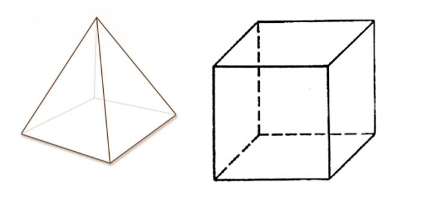

## Цели практической работы
Отработать: 

- применение множественного наследования, закрепить понимание порядка разрешения методов в Python;
- создание и применение примесей и абстрактных классов;
- применение декораторов `setter` и `property`, а также `classmethod` для более правильного и чистого кода.
## Что входит в работу
- Задача 1. Работа с файлом 2.
- Задача 2. Математический модуль.
- Задача 3. Моделирование.
- Задача 4. Дата.

## Задача 1. Работа с файлом 2
### Что нужно сделать
Реализуйте модернизированную версию контекст-менеджера File: 

- теперь при попытке открыть несуществующий файл менеджер автоматически создаёт и открывает этот файл в режиме записи; 
- на выходе из менеджера подавляются все исключения, связанные с файлами.
### Что оценивается
- Результат вычислений корректен.
- Модели реализованы в стиле ООП, основной функционал описан в методах классов и в отдельных функциях.
- При написании классов соблюдаются основные принципы ООП: инкапсуляция, наследование и полиморфизм.
  - Для получения и установки значений у приватных атрибутов используются сеттеры и геттеры с соответствующими декораторами.
  - Для создания нового класса на основе уже существующего используется наследование.
  - Для статических и классовых методов используется декоратор `classmethod`.
- Сообщения о процессе получения результата осмысленны и понятны для пользователя.
- Переменные, функции и собственные методы классов имеют значащие имена, не `a`, `b`, `c`, `d`.
- Классы и методы/функции имеют прописанную документацию.
- Есть аннотация типов для методов/функций и их аргументов (кроме `args` и `kwargs`). Если функция/метод ничего не возвращают, то используется `None`.
## Задача 2. Математический модуль
### Что нужно сделать
Ирина использует в своей программе очень много различных математических вычислений, связанных с фигурами. Например, нахождение их площадей или периметров. Поэтому, чтобы не захламлять код огромным количеством функций, она решила выделить для них отдельный класс, подключить как модуль и использовать по аналогии с модулем `math`.

Реализуйте класс `MyMath`, состоящий как минимум из следующих методов (можете бонусом добавить и другие методы):

- вычисление длины окружности,
- вычисление площади окружности,
- вычисление объёма куба,
- вычисление площади поверхности сферы.

Пример основного кода:
```python
res_1 = MyMath.circle_len(radius=5)
res_2 = MyMath.circle_sq(radius=6)
print(res_1)
print(res_2)
```

Результат:
```
31.41592653589793
113.09733552923255
```
### Что оценивается
- Результат вычислений корректен.
- Модели реализованы в стиле ООП, основной функционал описан в методах классов и в отдельных функциях.
- При написании классов соблюдаются основные принципы ООП: инкапсуляция, наследование и полиморфизм.
  - Для получения и установки значений у приватных атрибутов используются сеттеры и геттеры с соответствующими декораторами.
  - Для создания нового класса на основе уже существующего используется наследование.
  - Для статических и классовых методов используется декоратор `classmethod`.
- Формат вывода соответствует примеру.
- Переменные, функции и собственные методы классов имеют значащие имена, не `a`, `b`, `c`, `d`.
- Классы и методы/функции имеют прописанную документацию.
- Есть аннотация типов для методов/функций и их аргументов (кроме `args` и `kwargs`). Если функция/метод ничего не возвращают, то используется `None`.

## Задача 3. Моделирование
### Что нужно сделать
В проекте по 3D-моделированию используются две фигуры — куб и пирамида. Для моделирования этих фигур используются соответствующие 2D-фигуры, а именно квадрат и треугольник. Вся поверхность 3D-фигуры может храниться в виде списка. Например, для куба это будет [Square, Square, Square, Square, Square, Square].



Квадрат инициализируется длинами сторон, а треугольник — основанием и высотой. Каждая из 2D-фигур умеет находить свои периметр и площадь, а 3D-фигуры, в свою очередь, могут находить площадь своей поверхности.

Используя входные данные о фигурах и знания математики, реализуйте соответствующие классы и методы. Для базовых классов также реализуйте геттеры и сеттеры. 
### Что оценивается
- Результат вычислений корректен.
- Модели реализованы в стиле ООП, основной функционал описан в методах классов и в отдельных функциях.
- При написании классов соблюдаются основные принципы ООП: инкапсуляция, наследование и полиморфизм.
  - Для получения и установки значений у приватных атрибутов используются сеттеры и геттеры с соответствующими декораторами.
  - Для создания нового класса на основе уже существующего используется наследование.
  - Для статических и классовых методов используется декоратор `classmethod`.
- Сообщения о процессе получения результата осмысленны и понятны для пользователя.
- Переменные, функции и собственные методы классов имеют значащие имена, не `a`, `b`, `c`, `d`.
- Классы и методы/функции имеют прописанную документацию.
- Есть аннотация типов для методов/функций и их аргументов (кроме `args` и `kwargs`). Если функция/метод ничего не возвращают, то используется `None`.

## Задача 4. Дата
### Что нужно сделать
Реализуйте класс `Date`, который должен:

- проверять числа даты на корректность;
- конвертировать строку даты в объект класса `Date`, состоящий из соответствующих числовых значений дня, месяца и года.

Оба метода должны получать на вход строку вида `dd-mm-yyyy`.

При тестировании программы объект класса Date должен инициализироваться исключительно через метод конвертации, например:

```python
date = Date.from_string('10-12-2077')
```

Неверный вариант: `date = Date(10, 12, 2077)`

Пример основного кода:
```python
date = Date.from_string('10-12-2077')
print(date)
print(Date.is_date_valid('10-12-2077'))
print(Date.is_date_valid('40-12-2077'))
```

Результат:
```
День: 10	Месяц: 12	Год: 2077
True
False
```
### Что оценивается
- Результат вычислений корректен.
- Модели реализованы в стиле ООП, основной функционал описан в методах классов и в отдельных функциях.
- При написании классов соблюдаются основные принципы ООП: инкапсуляция, наследование и полиморфизм.
  - Для получения и установки значений у приватных атрибутов используются сеттеры и геттеры с соответствующими декораторами.
  - Для создания нового класса на основе уже существующего используется наследование.
  - Для статических и классовых методов используется декоратор `classmethod`.
- Формат вывода соответствует примеру.
- Переменные, функции и собственные методы классов имеют значащие имена, не `a`, `b`, `c`, `d`.
- Классы и методы/функции имеют прописанную документацию.
- Есть аннотация типов для методов/функций и их аргументов (кроме `args` и `kwargs`). Если функция/метод ничего не возвращают, то используется `None`.

